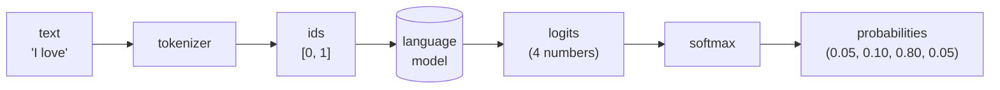
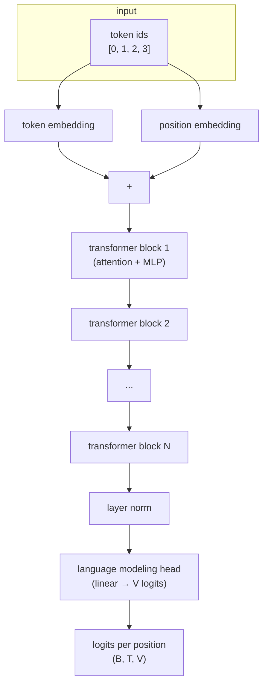

# Chapter 1 — What is a language model?

> *"The model is a function from text to a probability over what comes next. Everything else in this tutorial is engineering."*

This chapter has no code. It defines, in plain language and in mathematics, what a **language model** is, what makes one **large**, and what specifically a **GPT** is. By the end, you should be able to explain — to a friend, on a whiteboard — what the rest of the tutorial is going to build, and why.

If you finish this chapter and still feel a little fuzzy on any of the terms, that is fine. We come back to every single one of them with code.

---

## 1.1 The one-sentence definition

> **A language model is a probability distribution over sequences of tokens.**

That is all. Read the sentence twice. Three things are doing work in it:

1. **Tokens** — the small units of text the model deals with. They are not always whole words. We define them precisely in §1.3.
2. **Sequences of tokens** — finite ordered lists of tokens. A sentence, a paragraph, a Python file: all are sequences of tokens.
3. **Probability distribution** — a function that assigns each possible sequence a number between 0 and 1, with all the numbers summing to 1.

So a language model is a machine that, when you show it a sequence, can tell you *how likely* that sequence is to occur in the kind of text it was trained on. Equivalently — and this is the form we will actually compute — it can tell you, given the tokens you have so far, *how likely each possible next token is*.

We will write this conditional form as

$$
P(x_t \mid x_1, x_2, \ldots, x_{t-1})
$$

read aloud as *"the probability of the next token $x_t$ given everything we have seen so far."* Almost every equation in this tutorial is a way of computing that one quantity.

---

## 1.2 The running example: "I love AI!"

Throughout the entire tutorial we use one tiny example, over and over, until you can predict what each line of code does without running it:

```text
I  love  AI  !
```

Four tokens. A vocabulary of size four. Short enough to print on the screen and trace by hand, rich enough to demonstrate every idea.

Whenever you see `(B, T, C)` in later chapters — the shape of a tensor — you can hold this sentence in your head as one example with $T = 4$ and recover what the shape *means*.

---

## 1.3 Tokens, vocabularies, and IDs

A **vocabulary** is a finite set of symbols. Call its size $V$.

A **token** is one element of the vocabulary.

A **tokenizer** is a function that turns a piece of text (a string) into a sequence of tokens. Different tokenizers chop text differently:

- A **character tokenizer** splits `"I love AI!"` into `['I', ' ', 'l', 'o', 'v', 'e', ' ', 'A', 'I', '!']` — vocabulary is the set of distinct characters.
- A **word tokenizer** splits it into `['I', 'love', 'AI', '!']` — vocabulary is the set of distinct words.
- A **subword tokenizer** (what real GPTs use) splits it into something like `['I', ' love', ' AI', '!']` — vocabulary is the set of distinct subword pieces.

In Part I and Part II of this tutorial we use the **word tokenizer** above for clarity. In Part V we replace it with a character tokenizer to train on a real file.

For the rest of this chapter, fix the vocabulary

$$
\mathcal{V} = \{\, \texttt{I},\; \texttt{love},\; \texttt{AI},\; \texttt{!}\,\}, \qquad V = |\mathcal{V}| = 4.
$$

We assign each token an integer **id**:

| token  | id |
|--------|----|
| `I`    | 0  |
| `love` | 1  |
| `AI`   | 2  |
| `!`    | 3  |

Why ids? Because neural networks consume numbers, not strings. From the model's point of view, the sentence `"I love AI!"` is the integer sequence `[0, 1, 2, 3]`. The strings will not enter the math again until we generate text and look up which string each predicted id corresponds to.

---

## 1.4 What does a probability distribution over the next token look like?

Given the prefix `"I love"`, a language model produces a number for every token in the vocabulary:

```text
P(next = "I"    | "I love") = 0.05
P(next = "love" | "I love") = 0.10
P(next = "AI"   | "I love") = 0.80
P(next = "!"    | "I love") = 0.05
```

These four numbers must be non-negative and sum to 1. We will store them as a length-$V$ vector and call it $\mathbf{p}$:

$$
\mathbf{p} = (0.05,\; 0.10,\; 0.80,\; 0.05), \qquad \sum_{i=0}^{V-1} p_i = 1.
$$

The model will not return $\mathbf{p}$ directly. It returns a vector of unnormalised real numbers called **logits** — one per token — and we turn the logits into a distribution with a function called **softmax**. We will define softmax in Chapter 5; for now the only thing to remember is *the model's output, after softmax, is a probability distribution over the next token*.

A diagram of the whole picture, before any architecture is decided:



The shaded box marked *language model* is the entire content of this tutorial. Everything else — tokenizer, softmax, picking a token from the distribution — is one or two short functions we will write.

---

## 1.5 The chain rule: from "next token" to "whole sequence"

We claimed in §1.1 that a language model defines a probability over **sequences**. We have only shown how to get the probability of one **next** token. How are these connected?

By the chain rule of probability, the probability of a sequence factorises into next-token probabilities:

$$
P(x_1, x_2, \ldots, x_T) \;=\; \prod_{t=1}^{T} P(x_t \mid x_1, \ldots, x_{t-1}).
$$

In words: *the probability of the whole sentence is the product of the probability of each token given everything before it.*

For our running example, with $T = 4$:

$$
\begin{aligned}
P(\texttt{I, love, AI, !}) \;=\;
& P(\texttt{I}) \\
\cdot\; & P(\texttt{love} \mid \texttt{I}) \\
\cdot\; & P(\texttt{AI} \mid \texttt{I, love}) \\
\cdot\; & P(\texttt{!} \mid \texttt{I, love, AI}).
\end{aligned}
$$

So if we can compute next-token probabilities, we can compute sequence probabilities by multiplying them. And — crucially for training, as we will see in Chapter 13 — we can compute next-token probabilities for **all positions in a sequence at once**.

A model that factors $P$ this way, left-to-right, is called **autoregressive**. GPT is autoregressive. So is everything we will build in this tutorial.

---

## 1.6 A by-hand example: counting bigrams

Before we touch a neural network, let's compute next-token probabilities by hand from a tiny corpus. This is the simplest possible language model: a **bigram model**, which assumes $P(x_t \mid x_1, \ldots, x_{t-1}) = P(x_t \mid x_{t-1})$ — only the previous token matters.

Suppose our entire training corpus is these three sentences:

```text
1.  I love AI !
2.  I love I !
3.  AI love AI !
```

Each ends with `!`. We want to estimate, for every pair of tokens $(a, b)$, the probability that the model predicts $b$ when the previous token was $a$. The classical estimator is **count, then normalise**:

$$
\hat{P}(b \mid a) \;=\; \frac{\text{count}(a, b)}{\sum_{b'} \text{count}(a, b')}.
$$

Step 1 — count every adjacent pair $(a, b)$ in the corpus. Going through the three sentences:

- sentence 1 contributes pairs `(I, love), (love, AI), (AI, !)`,
- sentence 2 contributes pairs `(I, love), (love, I), (I, !)`,
- sentence 3 contributes pairs `(AI, love), (love, AI), (AI, !)`.

Tally them into a table where rows are the previous token $a$ and columns are the next token $b$:

| previous \ next | `I` | `love` | `AI` | `!` | row total |
|---|---|---|---|---|---|
| `I`    | 0 | 2 | 0 | 1 | 3 |
| `love` | 1 | 0 | 2 | 0 | 3 |
| `AI`   | 0 | 1 | 0 | 2 | 3 |
| `!`    | 0 | 0 | 0 | 0 | 0 |

Step 2 — divide each row by its total to turn counts into a probability distribution over the next token:

| previous \ next | `I` | `love` | `AI` | `!` |
|---|---|---|---|---|
| `I`    | 0.00 | **0.67** | 0.00 | 0.33 |
| `love` | 0.33 | 0.00 | **0.67** | 0.00 |
| `AI`   | 0.00 | 0.33 | 0.00 | **0.67** |
| `!`    | — | — | — | — |

The `!` row has no observations after it, so the model has nothing to say about what follows `!` — we will treat `!` as an end-of-sentence marker.

That table **is** a language model. To predict the next token after `love`, we read row `love` and sample from `(0.33, 0.00, 0.67, 0.00)`. Most of the time we will get `AI`.

To compute the probability of the whole sentence `"I love AI !"` under this model:

$$
\begin{aligned}
\hat{P}(\texttt{I, love, AI, !}) \;&=\; \hat{P}(\texttt{I}) \cdot \hat{P}(\texttt{love} \mid \texttt{I}) \cdot \hat{P}(\texttt{AI} \mid \texttt{love}) \cdot \hat{P}(\texttt{!} \mid \texttt{AI}) \\
&=\; \tfrac{2}{3} \cdot \tfrac{2}{3} \cdot \tfrac{2}{3} \cdot \tfrac{2}{3} \;=\; \tfrac{16}{81} \;\approx\; 0.198.
\end{aligned}
$$

(The first factor, $\hat{P}(\texttt{I}) = 2/3$, comes from counting how often each token starts a sentence: `I` starts 2 of the 3 sentences in our corpus. The point is the *form* of the calculation, not the exact number — a real implementation would also handle a special start-of-sentence symbol explicitly.)

Three lessons from this exercise:

1. **A language model is just a table** — in this case, a $V \times V$ table of probabilities. Bigger models replace the table with a neural network, but the **input/output shape is the same**: feed in a context, get out a probability over the next token.
2. **Counting works, but only just.** With three sentences we already have a row of zeros (`!`), and any pair we never saw gets probability zero — even if it is perfectly reasonable. Real corpora have millions of zeros. This is why we need models that can *generalise* across contexts. That is what neural networks buy us.
3. **The vocabulary size dominates the table size.** Our $V \times V$ table has $V^2 = 16$ entries. For a real LLM, $V \approx 50{,}000$, so the bigram table alone has $2.5 \times 10^9$ entries — and bigrams are still a terrible model. We need something cleverer.

---

## 1.7 What makes a language model "large"?

The qualifier *large* in **L**LM is informal. In practice it refers to three things growing together:

| dimension       | small           | large (GPT-2)                     | very large (GPT-4-class) |
|-----------------|-----------------|-----------------------------------|---------------------------|
| **parameters**  | thousands       | $\sim 1.5 \times 10^9$            | $\sim 10^{12}$            |
| **training data** | a single book | $\sim 10^{10}$ tokens of web text | $\sim 10^{13}$ tokens     |
| **compute**     | minutes on a CPU | days on a small GPU cluster     | months on a large cluster |

A **parameter** is a real number stored inside the model that gets adjusted during training. The bigram table from §1.6 has $V^2 = 16$ "parameters" (one per cell). A GPT-2-sized model has about $1.5$ billion parameters, organised not as a single table but as the weights of dozens of stacked neural-network layers. We are going to build all of that, layer by layer, starting in Chapter 9.

The target of this tutorial is **GPT-2 architecture**. We will not train it on $10^{10}$ tokens — your laptop cannot afford that — but the package we build is architecturally complete. If you had the GPUs, you could feed it the OpenWebText dataset and produce GPT-2.

---

## 1.8 What specifically is a GPT?

**GPT** stands for **Generative Pretrained Transformer**. The three words each correspond to a design choice:

- **Generative** — the model produces text, by repeatedly sampling next tokens from its predicted distribution. Compare with classifiers, which produce a single label.
- **Pretrained** — the model is first trained on a huge generic corpus (predicting the next token, the same job as in §1.6), then optionally fine-tuned for specific tasks. We focus on pretraining.
- **Transformer** — a specific neural-network architecture, introduced in 2017, built around an operation called **self-attention**. Part II of this tutorial is dedicated to attention; Part III assembles the rest of the transformer around it.

More precisely, a GPT is a **decoder-only autoregressive transformer**. "Decoder-only" means the architecture has only the generative half of the original transformer (the half that predicts new tokens), not the half that reads a separate input sentence. "Autoregressive" we already met: it predicts one token at a time, conditioned on everything to the left.

We are not yet ready to draw the full GPT architecture — we have not introduced any of the pieces — but the high-level skeleton is small enough to put on one page:



Every box in that diagram corresponds to one or two chapters of this tutorial. By Chapter 12 you will have built the entire diagram.

---

## 1.9 Generation: turning a model into text

Once we have a trained language model — i.e. a function that maps a context to a distribution over the next token — generation is a loop. Starting from some initial tokens (the *prompt*), repeatedly:

1. Run the model on the current context. Get a probability vector $\mathbf{p}$ of length $V$.
2. Pick one token from $\mathbf{p}$. The simplest choice is to take the token with the highest probability (**greedy decoding**); a more interesting choice is to **sample** a token, treating $\mathbf{p}$ as a real probability distribution.
3. Append the chosen token to the context. Go to 1.

Stop when you hit a maximum length, or when the model emits an end-of-sentence token.

That is the entire generation algorithm. We will implement it in Chapter 15. The interesting question — *how does the model end up with good probability vectors in the first place?* — is what training is about, and that takes us through Chapters 4 and 14.

---

## 1.10 What you will have built by the end of this tutorial

Concretely, by the time you reach Chapter 18:

- a Python package called `mygpt`, installable with `uv`, exposing a `GPT` class and helper functions for tokenisation, training, and generation;
- a training loop that takes a plain text file and a few hyperparameters and produces a checkpoint;
- a CLI you can invoke as

  ```text
  uv run python -m mygpt.generate --checkpoint ckpt.pt --prompt "I love" --max_new_tokens 50
  ```

  to sample text from a trained model;
- 18 chapters of explanation that justify every line in the package.

You will *not* have:

- a frontier-scale model — we do not have the compute, and that is a research-engineering problem, not a fundamentals problem;
- fine-tuning, RLHF, or alignment infrastructure — those are separate tutorials;
- exotic architectures (mixture of experts, state-space models). We build the canonical decoder-only transformer.

If after Chapter 18 you want to extend `mygpt` toward any of those, you will have the foundation to do so.

---

## 1.11 What's next

Chapter 1 had no code on purpose: the goal was definitions, intuition, and a mental map of the destination. From Chapter 2 onward every chapter introduces code, every code block is a file you save, every shell command is one you run, and every "Expected output" block is something you should reproduce on your own machine.

In Chapter 2 we set up the `mygpt` project with `uv`, install our first dependency (PyTorch), and write a tiny end-to-end script that touches the same four tokens we used here.

> **Looking ahead — what to remember from this chapter**
>
> 1. A language model is a probability distribution over token sequences.
> 2. We build it autoregressively: it predicts one token at a time, given everything before.
> 3. The vocabulary is a fixed finite set; tokens become integer ids before they enter any math.
> 4. The simplest language model is a count-based table; a GPT replaces that table with a deep transformer that *generalises*.
> 5. Training adjusts the model's parameters to make real text more probable; generation samples tokens from the trained distribution.

On to [Chapter 2 — Project setup with `uv`](02_project_setup.md).
