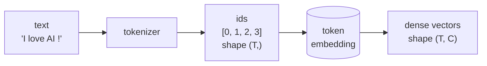

# Chapter 5 — From text to numbers: tokens and embeddings

In Chapter 3 we briefly turned token ids into one-hot vectors and noted that the representation was wasteful. In this chapter we replace one-hot with a **learned embedding**: every token is mapped to a small dense vector that the model can train. This is the first piece of `mygpt` that has *parameters worth training* — and it is the entry point of every transformer in existence.

By the end you will have:

- understood why one-hot is mathematically equivalent to a row lookup, and why the lookup is the cheap implementation;
- built `mygpt.TokenEmbedding`, a `nn.Module` that owns a `(V, C)` parameter matrix and looks up rows by id;
- run the running example `"I love AI !"` end-to-end through the embedding and observed the resulting `(T, C)` tensor;
- met the `(B, T, C)` shape that every later chapter operates on.

There is a little maths, all of it from §3.5: matrix indexing, matrix-vector multiplication, and the special case of multiplying by a one-hot.

---

## 5.1 The big picture: from id to vector

After Chapter 3 we have a function `mygpt.to_ids` that turns the sentence `"I love AI !"` into the integer tensor `[0, 1, 2, 3]`. After this chapter we will have a function that turns those integers into a $T \times C$ tensor of real numbers — one row per token, $C$ columns per row. The number $C$ is the **embedding dimension** (also called the channel dimension; we have been calling it `C` since Chapter 3).



Why do we need this step? Two reasons, one mathematical and one practical:

- **Mathematical:** the rest of the model (attention, MLP, layer norm) is built from operations that take real-valued vectors and produce real-valued vectors. Integer ids carry no notion of "near" or "far" — they are just labels. We need to give every token a *position in $\mathbb{R}^C$* so that the model has something it can compute with.
- **Practical:** the *which* of where each token sits is itself learnable. After training, similar tokens (e.g. synonyms) tend to land near each other in $\mathbb{R}^C$. We do not arrange this by hand; gradient descent does it for us, because the loss decreases when nearby contexts get nearby vectors.

The key data structure is a **single $V \times C$ matrix** $E$ — one row per vocabulary token. We will see it three ways: as a parameter matrix, as a one-hot multiplication, and as PyTorch's `nn.Embedding`.

---

## 5.2 Setup

This chapter assumes you finished Chapter 4 — `mygpt/` exists, `torch` and `numpy` are installed, and `src/mygpt/__init__.py` matches the version we wrote in §4.7 (it has `VOCAB`, `to_ids`, and `set_seed`).

If you skipped Chapter 4, recreate the state from a clean directory:

```bash
uv init mygpt --package
cd mygpt
mkdir -p experiments
uv add torch numpy
```

Then overwrite **`src/mygpt/__init__.py`** with the Chapter 4 ending state:

```python
"""mygpt — a tiny GPT-2-like language model, built one chapter at a time."""

import torch


VOCAB: tuple[str, ...] = ("I", "love", "AI", "!")


def to_ids(tokens: list[str]) -> torch.Tensor:
    return torch.tensor([VOCAB.index(t) for t in tokens], dtype=torch.long)


def set_seed(seed: int = 0) -> None:
    torch.manual_seed(seed)
```

You are ready.

---

## 5.3 The problem with one-hot

Recall from §3.9: the one-hot encoding of an id $i \in \{0, \ldots, V-1\}$ is the length-$V$ vector that is $1$ at position $i$ and $0$ everywhere else. For $V = 4$ the four one-hots are the rows of the $4 \times 4$ identity matrix.

To turn a one-hot vector into a $C$-dimensional vector we multiply by an embedding matrix $E$ of shape $(V, C)$:

$$
\mathbf{e}_i \;=\; \text{one-hot}(i) \cdot E \;\in\; \mathbb{R}^{C}.
$$

Because `one-hot(i)` is zero except at position $i$, this matrix-vector product picks out exactly **the $i$-th row of $E$**. The other $V - 1$ rows contribute nothing — they are multiplied by zero.

Two problems with this implementation:

1. **Wasted multiplications.** For $V = 50{,}000$ and $C = 768$ (small GPT scale), the multiplication is $V \times C = 38.4$ million operations, of which $V - 1 = 49{,}999$ contribute zero. We can do $C = 768$ operations instead by indexing directly: $E[i]$.
2. **Wasted memory.** A one-hot vector of length $50{,}000$ is 99.998% zeros. We carry 50,000 numbers around to communicate one integer.

**The fix is the embedding lookup**: store $E$ as a parameter matrix; given an id $i$, return the row $E[i]$. Do not materialise the one-hot. Do not do the matrix multiplication. They are mathematically equivalent — the lookup is a $V$-times-cheaper implementation of the same function.

We verify this equivalence in the next experiment.

**Save the following to** 📄 `experiments/10_lookup_vs_onehot.py`:

```python
"""Experiment 10 — One-hot @ W and W[id] are the same thing.

Demonstrates that multiplying a one-hot vector by an embedding matrix
gives the same result as indexing the matrix by the id directly. The
lookup is the cheap implementation; the one-hot is the conceptual
explanation.
"""

import torch
import torch.nn.functional as F

from mygpt import set_seed


def main() -> None:
    set_seed(0)
    V, C = 4, 4
    W = torch.randn(V, C)
    print("Embedding matrix W (V=4, C=4):")
    print(W)
    print()

    target_id = 1
    onehot = F.one_hot(torch.tensor(target_id), num_classes=V).float()
    print(f"one-hot for id={target_id}: {onehot}")

    out_onehot = onehot @ W
    out_index = W[target_id]
    print(f"\none-hot @ W   = {out_onehot}")
    print(f"W[{target_id}]            = {out_index}")
    print(f"identical:    {torch.equal(out_onehot, out_index)}")


if __name__ == "__main__":
    main()
```

Run it:

```bash
uv run python experiments/10_lookup_vs_onehot.py
```

**Expected output:**

```text
Embedding matrix W (V=4, C=4):
tensor([[-1.1258, -1.1524, -0.2506, -0.4339],
        [ 0.8487,  0.6920, -0.3160, -2.1152],
        [ 0.3223, -1.2633,  0.3500,  0.3081],
        [ 0.1198,  1.2377,  1.1168, -0.2473]])

one-hot for id=1: tensor([0., 1., 0., 0.])

one-hot @ W   = tensor([ 0.8487,  0.6920, -0.3160, -2.1152])
W[1]            = tensor([ 0.8487,  0.6920, -0.3160, -2.1152])
identical:    True
```

The two routes return the same vector. From now on we use `W[id]`.

---

## 5.4 `nn.Embedding`: the lookup as a Module

PyTorch ships the lookup as `nn.Embedding(num_embeddings, embedding_dim)`. Internally it owns a `(num_embeddings, embedding_dim)` parameter matrix called `.weight` (initialised from $\mathcal{N}(0, 1)$ by default, though more sophisticated schemes are common in real models). When you call it on a tensor of integer ids, it returns the corresponding rows of `.weight`, batched to whatever shape you passed in.

The shape rule is simple: if `ids` has shape `(...)`, then `embedding(ids)` has shape `(..., embedding_dim)`. So a 1-D tensor of $T$ ids becomes a 2-D tensor of shape $(T, C)$; a 2-D batch of shape $(B, T)$ becomes 3-D $(B, T, C)$. You will see the second form constantly from Chapter 6 onward.

**Save the following to** 📄 `experiments/11_nn_embedding.py`:

```python
"""Experiment 11 — nn.Embedding as a packaged lookup.

Creates a small embedding, looks up token ids, and confirms the output
is exactly the corresponding rows of the embedding's weight matrix.
"""

import torch
import torch.nn as nn

from mygpt import VOCAB, set_seed, to_ids


def main() -> None:
    set_seed(0)
    V, C = len(VOCAB), 4
    emb = nn.Embedding(V, C)

    print(f"nn.Embedding({V}, {C})")
    print(f"  weight.shape         = {tuple(emb.weight.shape)}")
    print(f"  weight.requires_grad = {emb.weight.requires_grad}")
    print(f"  total parameters     = {sum(p.numel() for p in emb.parameters())}")
    print()

    print("emb.weight (V x C):")
    print(emb.weight)
    print()

    # 1-D ids → 2-D embedded vectors
    ids = to_ids(["I", "love", "AI", "!"])
    out = emb(ids)
    print(f"emb(ids) where ids={ids.tolist()}:")
    print(out)
    print(f"\nshape: {tuple(ids.shape)} -> {tuple(out.shape)}")

    # Confirm: emb(ids) == emb.weight[ids]
    print(f"matches emb.weight[ids]: {torch.equal(out, emb.weight[ids])}")


if __name__ == "__main__":
    main()
```

Run it:

```bash
uv run python experiments/11_nn_embedding.py
```

**Expected output:**

```text
nn.Embedding(4, 4)
  weight.shape         = (4, 4)
  weight.requires_grad = True
  total parameters     = 16

emb.weight (V x C):
Parameter containing:
tensor([[-1.1258, -1.1524, -0.2506, -0.4339],
        [ 0.8487,  0.6920, -0.3160, -2.1152],
        [ 0.3223, -1.2633,  0.3500,  0.3081],
        [ 0.1198,  1.2377,  1.1168, -0.2473]], requires_grad=True)

emb(ids) where ids=[0, 1, 2, 3]:
tensor([[-1.1258, -1.1524, -0.2506, -0.4339],
        [ 0.8487,  0.6920, -0.3160, -2.1152],
        [ 0.3223, -1.2633,  0.3500,  0.3081],
        [ 0.1198,  1.2377,  1.1168, -0.2473]], grad_fn=<EmbeddingBackward0>)

shape: (4,) -> (4, 4)
matches emb.weight[ids]: True
```

Three observations:

- The embedding has **`V × C = 16` parameters** for $V = 4$, $C = 4$. The general formula is $V \cdot C$. For GPT-2 with $V = 50{,}257$, $C = 768$, that is about 38.6 million parameters — and that is just the embedding layer. Token embeddings dominate the parameter count of small language models.
- `emb.weight` is an `nn.Parameter` (note `requires_grad=True`). It will receive gradients on `.backward()` and be updated by an optimiser, exactly like the `w` and `b` of Chapter 4.
- `emb(ids)` and `emb.weight[ids]` are byte-identical. The first runs through PyTorch's autograd so we get gradients into `emb.weight`; the second is a plain index op. Use `emb(...)` in real code so backprop works; use `emb.weight[id]` only for inspection.

---

## 5.5 The `(B, T, C)` shape

Real models train on **batches** of sequences in parallel. If we have $B$ sequences each of length $T$, our token ids form a tensor of shape $(B, T)$, and the embedded output is $(B, T, C)$. Every later chapter — attention, transformer block, training loop — operates on this three-axis tensor.

For our running example with $B = 1$, $T = 4$:

```text
ids: shape (1, 4)             embedded: shape (1, 4, C)
[[0, 1, 2, 3]]                [[ row 0 of E,
                                 row 1 of E,
                                 row 2 of E,
                                 row 3 of E ]]
```

`nn.Embedding` handles both 1-D and 2-D id inputs without any extra work — it just attaches a new `C` axis on the end. We will lean on this property heavily once we start batching real text in Chapter 14.

---

## 5.6 Extending `mygpt`: `TokenEmbedding`

Time to put the embedding into the package. We wrap `nn.Embedding` in a `mygpt.TokenEmbedding` `nn.Module`, both because:

- it gives us a stable name in the `mygpt` API (later chapters will refer to `mygpt.TokenEmbedding`, never `nn.Embedding` directly), and
- it lets us add behaviour later without breaking callers — for example, sharing weights with the language-modelling head in Chapter 12.

**Replace the contents of** 📄 `src/mygpt/__init__.py` **with:**

```python
"""mygpt — a tiny GPT-2-like language model, built one chapter at a time.

After Chapter 5 the package knows about: the running-example vocabulary,
how to convert tokens to id tensors (Chapter 3), how to seed PyTorch's RNG
(Chapter 4), and a TokenEmbedding module that maps id tensors to dense
vector tensors (this chapter).
"""

import torch
import torch.nn as nn


VOCAB: tuple[str, ...] = ("I", "love", "AI", "!")
"""The four tokens used as the running example throughout this tutorial."""


def to_ids(tokens: list[str]) -> torch.Tensor:
    """Convert a list of vocabulary tokens to a 1-D tensor of integer ids."""
    return torch.tensor([VOCAB.index(t) for t in tokens], dtype=torch.long)


def set_seed(seed: int = 0) -> None:
    """Seed PyTorch's CPU random number generator."""
    torch.manual_seed(seed)


class TokenEmbedding(nn.Module):
    """Map a tensor of integer token ids to a tensor of dense embedding vectors.

    Inputs:
        token_ids: long tensor of arbitrary shape `(...)` containing values
            in `[0, vocab_size)`.

    Outputs:
        tensor of shape `(..., embed_dim)` with each id replaced by its
        learned `embed_dim`-vector.
    """

    def __init__(self, vocab_size: int, embed_dim: int) -> None:
        super().__init__()
        self.vocab_size = vocab_size
        self.embed_dim = embed_dim
        self.embedding = nn.Embedding(vocab_size, embed_dim)

    def forward(self, token_ids: torch.Tensor) -> torch.Tensor:
        return self.embedding(token_ids)


def main() -> None:
    print("Vocabulary:", VOCAB)
    print(f"Vocabulary size V = {len(VOCAB)}")
    sample = list(VOCAB)
    ids = to_ids(sample)
    print(f"to_ids({sample}) = {ids}")
    set_seed(0)
    te = TokenEmbedding(vocab_size=len(VOCAB), embed_dim=4)
    print(f"\nTokenEmbedding(V={len(VOCAB)}, C=4):")
    print(te)
    print(f"params = {sum(p.numel() for p in te.parameters())}")
    print(f"\nte(ids) shape = {tuple(te(ids).shape)}")
```

Run the package entry-point to confirm:

```bash
uv run mygpt
```

**Expected output:**

```text
Vocabulary: ('I', 'love', 'AI', '!')
Vocabulary size V = 4
to_ids(['I', 'love', 'AI', '!']) = tensor([0, 1, 2, 3])

TokenEmbedding(V=4, C=4):
TokenEmbedding(
  (embedding): Embedding(4, 4)
)
params = 16

te(ids) shape = (4, 4)
```

The default `nn.Module.__repr__` shows the structure of nested modules — here, `TokenEmbedding` has one child named `embedding`. We will see longer module trees from Chapter 11 onward.

---

## 5.7 End-to-end example: encoding `"I love AI !"`

Putting it all together, here is the entire path from a Python list of strings to a `(T, C)` tensor of dense vectors, using only the public API of `mygpt`.

**Save the following to** 📄 `experiments/12_token_embedding.py`:

```python
"""Experiment 12 — End-to-end: text → ids → dense vectors via mygpt.TokenEmbedding."""

import torch

from mygpt import VOCAB, TokenEmbedding, set_seed, to_ids


def main() -> None:
    set_seed(0)

    V, C = len(VOCAB), 4
    te = TokenEmbedding(vocab_size=V, embed_dim=C)
    print(f"TokenEmbedding(V={V}, C={C}) — {sum(p.numel() for p in te.parameters())} params\n")

    # 1-D path: a single sentence
    ids = to_ids(["I", "love", "AI", "!"])
    out = te(ids)
    print(f"single sentence:")
    print(f"  ids       shape={tuple(ids.shape)}    {ids.tolist()}")
    print(f"  embedded  shape={tuple(out.shape)}  (T, C)")
    print(out)
    print()

    # 2-D path: a batch of sentences
    batch = torch.stack([
        to_ids(["I", "love", "AI", "!"]),
        to_ids(["AI", "love", "I", "!"]),
    ])
    out_batch = te(batch)
    print(f"batched:")
    print(f"  ids       shape={tuple(batch.shape)}    (B, T)")
    print(f"  embedded  shape={tuple(out_batch.shape)}  (B, T, C)")


if __name__ == "__main__":
    main()
```

Run it:

```bash
uv run python experiments/12_token_embedding.py
```

**Expected output:**

```text
TokenEmbedding(V=4, C=4) — 16 params

single sentence:
  ids       shape=(4,)    [0, 1, 2, 3]
  embedded  shape=(4, 4)  (T, C)
tensor([[-1.1258, -1.1524, -0.2506, -0.4339],
        [ 0.8487,  0.6920, -0.3160, -2.1152],
        [ 0.3223, -1.2633,  0.3500,  0.3081],
        [ 0.1198,  1.2377,  1.1168, -0.2473]], grad_fn=<EmbeddingBackward0>)

batched:
  ids       shape=(2, 4)    (B, T)
  embedded  shape=(2, 4, 4)  (B, T, C)
```

The single-sentence rows are exactly the rows of `te.embedding.weight` (visible in experiment 11). The batched output has shape `(B, T, C) = (2, 4, 4)`: two sequences, four tokens each, four numbers per token.

---

## 5.8 Why embeddings are powerful: parameters that learn

The 16 numbers in `te.embedding.weight` started life as samples from $\mathcal{N}(0, 1)$ — random. They have no semantic content yet. The whole reason `nn.Embedding` is a `Module` with a `Parameter` is that an **optimiser will adjust those numbers during training**, exactly like the $w$ and $b$ of Chapter 4.

We do not yet have a training task — that needs the rest of the model (Chapters 6–13). But the mechanism is identical: forward pass → loss → `loss.backward()` populates `te.embedding.weight.grad` → `optimizer.step()` updates the weight. After training on a real corpus, similar tokens converge to nearby vectors. We will *see* this happen at the end of Chapter 14.

For now, two pieces of evidence that the embedding really is a parameter:

1. `te.embedding.weight.requires_grad` is `True` (visible in experiment 11).
2. `list(te.parameters())` returns the weight matrix; an `Optimizer` constructed with `te.parameters()` will update it on `.step()`.

We will trust both and move on.

---

## 5.9 Experiments

1. **Bigger embedding dimension.** In `experiments/12_token_embedding.py`, change `C = 4` to `C = 32`. Re-run. The shapes printed should become `(4, 32)` and `(2, 4, 32)`. Parameter count grows from 16 to $V \cdot C = 128$.
2. **Confirm a fresh `nn.Embedding` is normally distributed.** Add the line `print(emb.weight.flatten().mean().item(), emb.weight.flatten().std().item())` to the end of `experiments/11_nn_embedding.py` (after the `matches` line) and run. With only 16 numbers the sample mean and std will not be exactly $0$ and $1$ — they will be roughly $-0.12$ and $0.94$ at seed 0. With $V \cdot C = 1000$ numbers (set $V = 100, C = 10$) the mean will be much closer to $0$ (around $0.03$) and the std much closer to $1$ (around $1.03$).
3. **Two ids, same vector.** What happens if you call `emb(torch.tensor([1, 1, 1]))`? Predict the shape and the relationship between rows; verify by running. (Hint: it's $(3, C)$ and the three rows are identical.)
4. **Nothing changes after `.zero_grad()`.** In a Python session, do `te = TokenEmbedding(4, 4); set_seed(0)` then call `te.zero_grad()`. Print `te.embedding.weight.grad`. Why is the result `None` rather than a zero tensor? (Hint: `.zero_grad()` only resets `.grad` if it has been allocated, which only happens after the first `.backward()`.)

After each experiment, restore the file you changed before moving on.

---

## 5.10 Exercises

1. **Count embedding parameters for GPT-2 small.** GPT-2 small has $V = 50{,}257$ and $C = 768$. How many parameters are in its token embedding alone? Express the answer in millions, to two decimal places.
2. **Why share weights with the head?** GPT-2 ties the token-embedding matrix with the final language-modelling head's weight matrix (we will build that in Chapter 12). The head is shape $(C, V)$ and the embedding is shape $(V, C)$ — one is the transpose of the other. If they are tied, what fraction of GPT-2 small's parameters does the token embedding account for? (Hint: the model has ~124 M parameters total; the embedding is ~38.6 M; tied means we count them once, not twice.)
3. **Embedding lookup is a 0-th-order operation.** Argue from §5.3 that `emb(ids)` involves no multiplications and no additions — only memory reads. (This is why embedding lookups are nearly free on a GPU and why we do not optimise them further.)

---

## 5.11 What's next

We can now turn token ids into dense vectors. The next question is: *given those vectors, how should we combine them so that each position's representation can depend on the others?* That is the job of **attention**, and it is the centerpiece of Part II.

In Chapter 6 we build single-head self-attention from scratch — by hand, on the four-token running example, with explicit query/key/value matrices. We will compute attention scores on paper before writing code, so you can see exactly how the operation knows that "love" should attend to "I" but not to "!".

> **Looking ahead — what to remember from this chapter**
>
> 1. An embedding is a $(V, C)$ parameter matrix; lookup by id returns a row.
> 2. `nn.Embedding(V, C)` is the packaged lookup. It has $V \cdot C$ parameters.
> 3. Token ids enter the model as `(B, T)`; embedded vectors come out as `(B, T, C)`.
> 4. `mygpt.TokenEmbedding` is our wrapper around `nn.Embedding`; later chapters refer to it, never `nn.Embedding` directly.

On to [Chapter 6 — Single-head self-attention from scratch](06_self_attention.md) *(coming soon)*.
